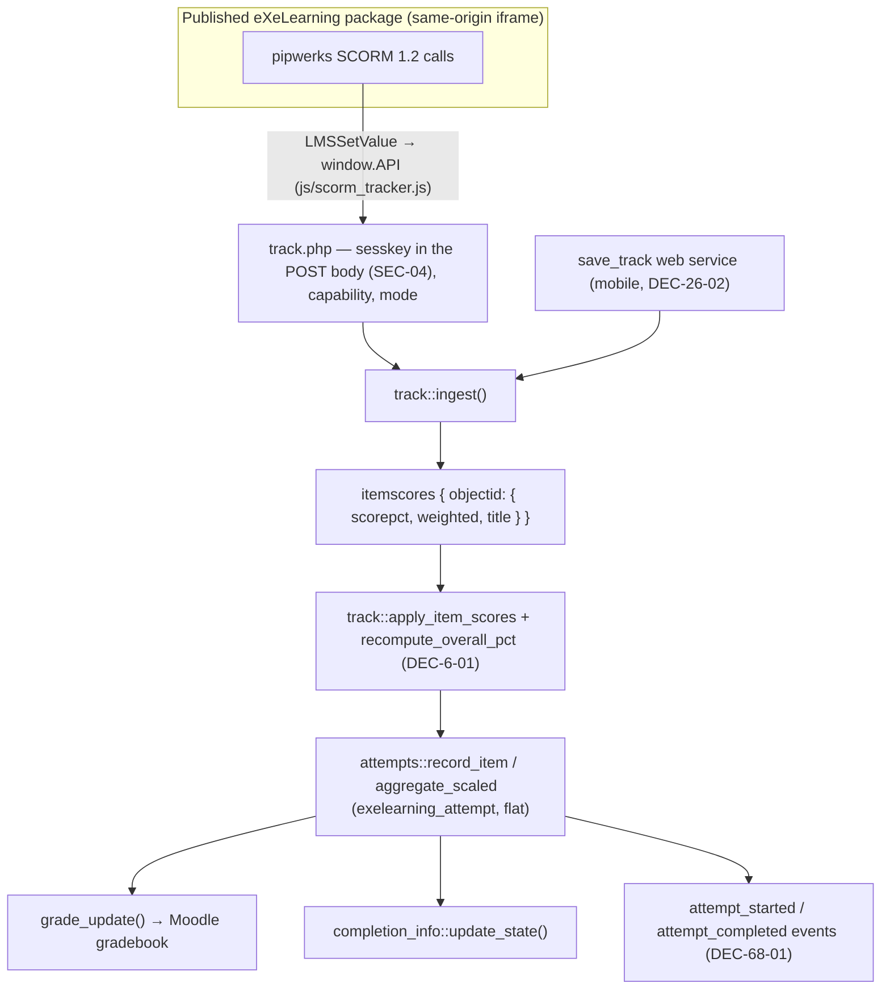

# Tracking architecture — SCORM 1.2, one channel

> Status: **implemented**. `mod_exelearning` grades through a **single** ingestion channel:
> the SCORM 1.2 shim (`js/scorm_tracker.js` → `track.php`) plus the mobile web service, both
> entering the same server-side pipeline. The second channel (xAPI ingestion, DEC-85-01) was
> **removed** in DEC-122-01 — see [Retired: the xAPI ingestion channel](#retired-the-xapi-ingestion-channel).
>
> Companion docs: `scorm-shim-current-flow.md` (the shim, step by step) and `TRACKING.md`
> (the end-to-end pipeline and its security model). Decision trail (Spanish ADRs) in
> `research/decisiones/adr/`.

## Principle

There is **one** internal model and **one** scoring entry point. Every source of scores is a
caller of that entry point, never a parallel pipeline:

- `exelearning_attempt` — **flat** attempt table, axis `itemnumber` 0..N + `sessiontoken`
  (DEC-0-07; the original header+detail design was evaluated and rejected — DEC-0-07:176-186).
- `exelearning_grade_item` — stable `objectid → itemnumber` map (DEC-5-01).
- `classes/local/track.php` + `attempts.php` — routing, overall recompute (DEC-6-01),
  attempt recording, `grademethod` aggregation, `grade_update()`. The orchestration is the
  single shared entry point `track::ingest()` (DEC-26-02): the web `track.php` and the mobile
  `save_track` web service both call it, so the two paths cannot diverge.

## Flow

## Trust boundary

Everything the server accepts from the package is validated server-side:

- Session + `sesskey` (in the POST body, never the query string — SEC-04); `cmid`/instance
  resolved server-side; `require_capability('mod/exelearning:savetrack')`.
- The browser maps the page-local `cmi.suspend_data` index to the stable `objectid`
  (DEC-5-01); the server accepts only objectids that already exist for **this** instance and
  drops the rest — grade items are never created from the client.
- The overall is recomputed from the per-iDevice scores instead of trusting the client's
  `cmi.core.score.raw` (DEC-6-01). The weights travel inline with each item, so the
  recomputed overall is a true **weighted** mean.
- Every score is clamped to the configured grade range, and the `itemscores` map is size-capped.
- `gradeenabled` is respected (DEC-13-07): with grading off no grade items exist, so
  `ingest()` acknowledges the request and writes nothing — no attempt row, no grade, no
  event (DEC-126-01). Turning the switch on starts recording subsequent requests, including
  any accumulated scores an already open viewer resends. New ungraded work cannot satisfy
  `completionstatusrequired` (DEC-69-01); historical attempt rows remain readable.
- Preview mode (DEC-0-06) acknowledges without writing.

## Retired: the xAPI ingestion channel

Between DEC-85-01 and DEC-122-01 the plugin ran a **second** channel: packages bundling the
upstream emitter (`libs/xapi/exe_xapi.js`) posted xAPI statements to the parent window, an
inline listener forwarded them to `xapi_track.php`, and an ingestor fed them into the same
`track::apply_item_scores()` / `attempts::record_item()` pipeline. While that channel was on,
the SCORM shim was deliberately inert for those packages.

It was removed because the measurement did not support it (DEC-122-01):

- **Per-iDevice grading was byte-identical** between the two channels — the same
  `sendScoreNew()` fires pipwerks and the emitter, so neither captures anything the other misses.
- **The overall was worse.** The per-iDevice `answered` statements carry no weight, so the xAPI
  path had to take the overall from the package statement — an *unweighted* 50 where SCORM's
  server-side recompute produces the true weighted 25 for a 25/75 pair.
- **Everything else was shared already.** Attempts, completion, gradebook publication and
  events all came from the same shared code, so the channel duplicated transport,
  authentication, validation and identity resolution to reach it.

Old packages still bundle the emitter and keep calling `window.parent.postMessage()`. That is
harmless: `_postToParent()` is fire-and-forget inside a `try`/`catch` — no acknowledgement, no
retry, no error path — so a message nothing listens for is simply discarded by the browser.
Its LRS transport (`_postToLrs`) stays inert unless the package is launched with xAPI launch
parameters, which this plugin never supplies.

**The `exelearning_tracking_events` table is dropped.** It was the channel's
audit/idempotency log, so with the channel gone nothing writes to or reads it. Its
`db/install.xml` definition, its `classes/privacy/provider.php` declarations and the eight
language strings that translated them are removed, and upgrade stage `2026082100` drops the
table wherever it exists. Stage 19, which created it, is left untouched: upgrade history is
append-only and has to keep working for a site that has the table.

The same stage calls `unset_config('xapiprimaryenabled', 'exelearning')`, mirroring what stage
20 did for the editor installer's configs. Removing a setting from the code without removing its
stored value leaves an orphan in `mdl_config_plugins` that a future setting reusing the name
would inherit.

**This does delete data, and that is a deliberate call.** `v4.0.2` and `v4.0.3` are public
releases and both ship the table plus a working writer, so a site that used the xAPI channel can
hold rows, and the table is absent from `backup/moodle2`. It is dropped anyway: what is lost is
the per-statement audit metadata it held — statement id, verb, objectid, registration and
scaled score — along with the `statement.id` deduplication those ids provided. It never stored
the statement JSON itself, and never a grade: grades, attempts and reports live in
`exelearning_grade_item` and `exelearning_attempt` and are untouched. The exposure window is
short (v4.0.2 is from 2026-07-07, in a plugin still in early deployment, with the channel
switchable off), and keeping an inert table would have meant fixing
and then maintaining two cleanup paths that never worked: neither `exelearning_delete_instance()`
nor `exelearning_reset_userdata()` ever cleaned it, so deleting an activity or resetting a course
orphaned those rows — unreachably, since the privacy API finds them by joining through the
`{exelearning}` row just deleted. `CHANGELOG.md` announces the removal under *Removed*, so an
administrator who wants those rows can dump them before upgrading. Recorded in `DEC-122-01` §4.

**Upgrading with a page open.** A learner holding an xAPI-era page when the upgrade lands keeps,
*in that tab only*, an inert SCORM shim (`disableTracking`, as it was served) and a listener
posting to `xapi_track.php`, which no longer exists. Those interactions are lost until the page
reloads and is served again with the SCORM shim active. This is the usual maintenance-mode
upgrade consideration, not a data-loss path: attempts already committed are unaffected.

## Scope

**Out of scope** and not planned: **cmi5**, any dependency on an external **LRS**, and a
`core_xapi` integration. SCORM 1.2 is the tracking standard (DEC-0-03), and the mobile web
service (DEC-26-02) is the supported non-browser route into the same pipeline.
